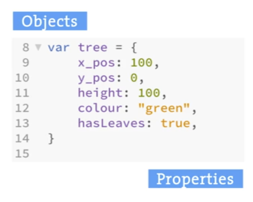
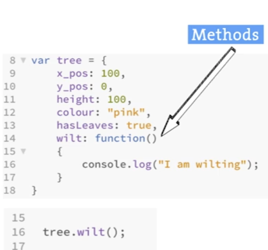
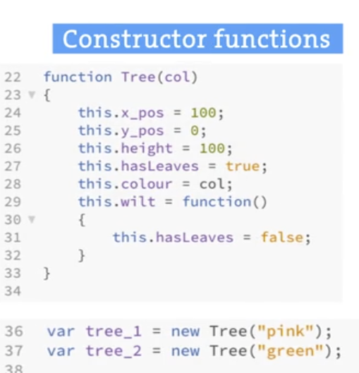
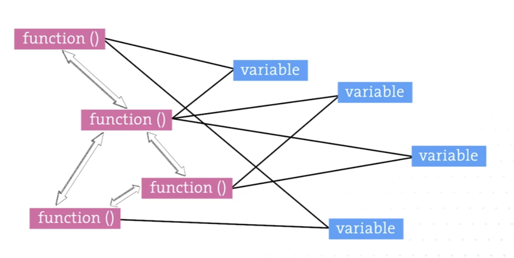
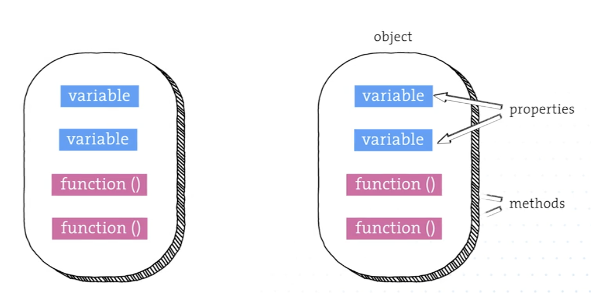
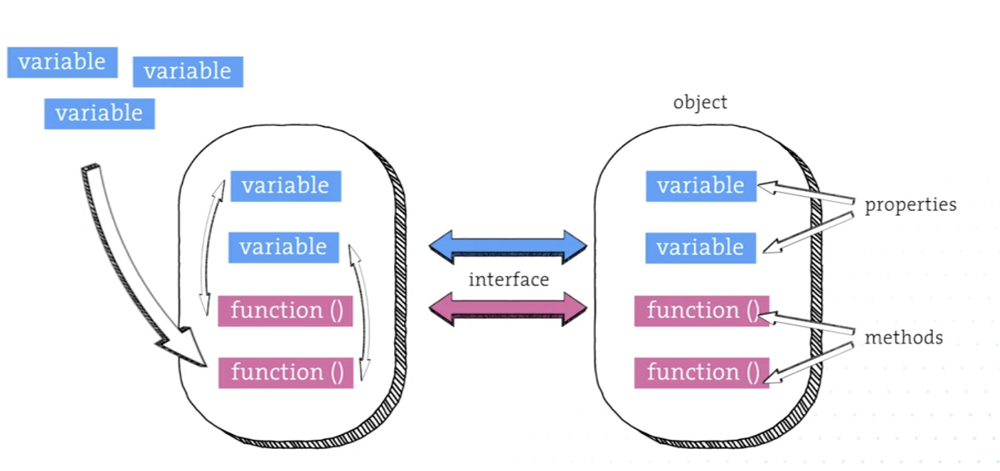
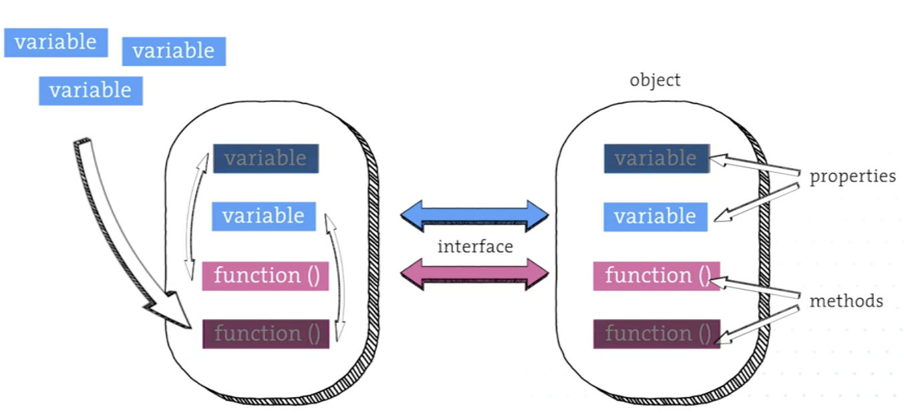
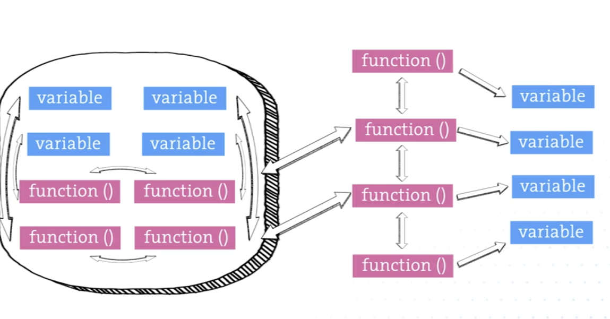

# Object orientation
## Object terms revised
- 
- 
- 

## Object orientation
- Spaghetti code:
    - 
- Encapsulation:
    - 
    - 
- Abstraction:
    - 
- Well abstracted and encapsulated object can easily be expanded or adapted without affecting rest of the code:
    - 